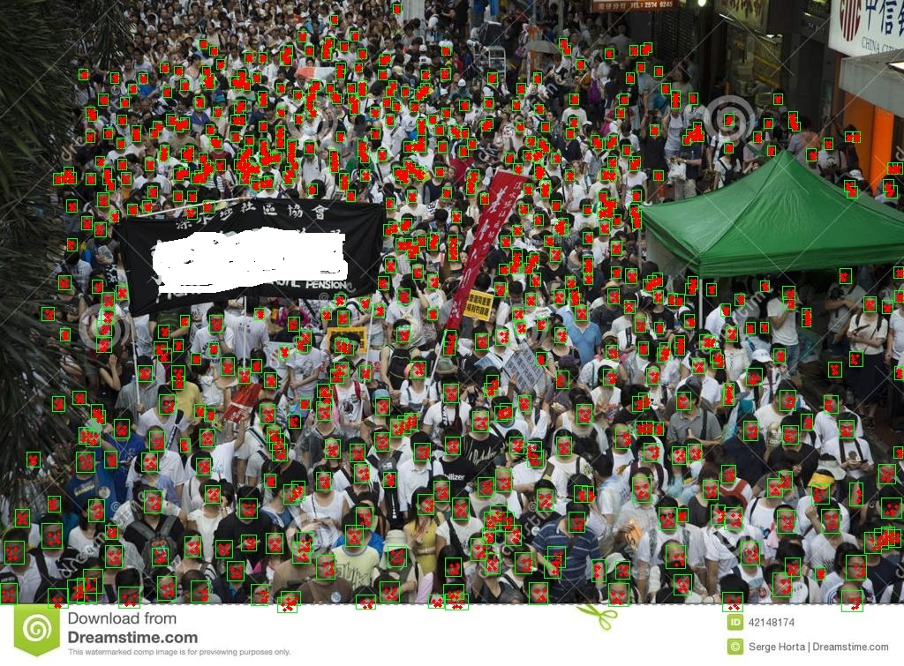
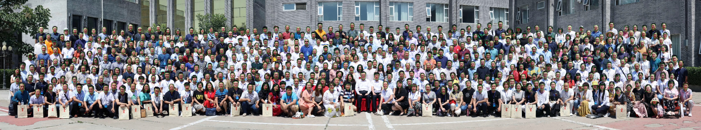

## CenterFace

### Introduce 

CenterFace(size of 7.3MB) is a practical anchor-free face detection and alignment method for edge devices.

    

### Recent Update
- `2019.09.13` CenterFace is released.

### Environment

- OpenCV 4.1.0
- Numpy
- Python3.6+

### Accuracy

- Results on val set of WIDER FACE:

Model Version|Easy Set|Medium Set|Hard Set
------|--------|----------|--------
FaceBoxes|0.840 |0.766 |0.395
FaceBoxes3.2×|0.798|0.802|0.715
RetinaFace-mnet|0.896|0.871|0.681
LFFD-v1|0.910|0.881|0.780
LFFD-v2|0.837|0.835|0.729
CenterFace|0.935|0.924|0.875
CenterFace-small|0.931|0.924|0.870

- Results on test set of WIDER FACE:

Model Version|Easy Set|Medium Set|Hard Set
------|--------|----------|--------
FaceBoxes|0.839 |0.763 |0.396
FaceBoxes3.2×|0.791|0.794|0.715
RetinaFace-mnet|0.896|0.871|0.681
LFFD-v1|0.910|0.881|0.780
LFFD-v2|0.837|0.835|0.729
CenterFace|0.932|0.921|0.873

> - **RetinaFace-mnet** is short for RetinaFace-MobileNet-0.25 from excellent work [insightface](https://github.com/deepinsight/insightface).
> - **LFFD-v1** is from prefect work [LFFD](https://github.com/YonghaoHe/A-Light-and-Fast-Face-Detector-for-Edge-Devices).
> - CenterFace/CenterFace-small evaluation is under MULTI-SCALE, FLIP. 
> - For SIO(Single Inference on the Original) evaluation schema, CenterFace also produces 92.2% (Easy), 91.1% (Medium) and 78.2% (Hard) for validation set.

- Results on FDDB:

Model Version|Disc ROC curves score
------|--------
RetinaFace-mnet|96.0@1000
LFFD-v1|97.3@1000
LFFD-v2|97.2@1000
CenterFace|97.9@1000
CenterFace-small|98.1@1000

### Inference Latency

- Latency on NVIDIA RTX 2080TI:

Resolution->|640×480|1280×720(704)|1920×1080(1056)
------------|-------|--------|---------
RetinaFace-mnet|5.40ms|6.31ms|10.26ms
LFFD-v1|7.24ms|14.58ms|28.36ms
CenterFace|5.5ms|6.4ms|8.7ms
CenterFace-small|4.4ms|5.7ms|7.3ms

#### Results: Face as Point
   
   
 
     
 
     


### Discussion

  Welcome to join in **QQ Group(912759877)** for more discussion, including but not limited to face detection, face anti-spoofing and so on.

### Author
 - [ywlife](https://github.com/ywlife)
 - [SyGoing](https://github.com/SyGoing)
 - [MirrorYuChen](https://github.com/MirrorYuChen)

###  Citation
If you benefit from our work in your research and product, please consider to cite the following related papers:
```
@inproceedings{CenterFace,
title={CenterFace: Joint Face Detection and Alignment Using Face as Point},
author={Xu, Yuanyuan and Yan, Wan and Sun, Haixin and Yang, Genke and Luo, Jiliang},
booktitle={arXiv:1911.03599},
year={2019}
}
```
