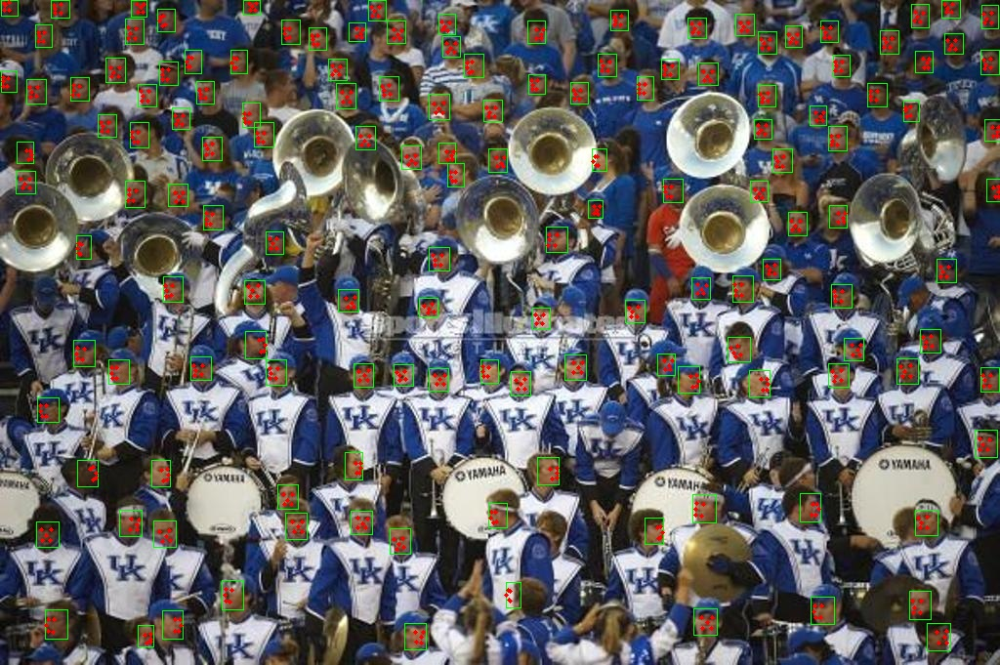

## CenterFace

### Introduce 

CenterFace(size of 7.3MB, and AP 88.0% on the WIDER FACE hard set) is a practical anchor-free face detector for edge devices.
CenterFace-small achieving AP equal to CenterFace while model size is only 2.3M.

### Recent Update
- `2019.09.13` CenterFace is released.

### Environment

- OpenCV 4.1.0
- Numpy
- Python3.6+

### Accuracy

- Results on val set of WIDER FACE:

Model Version|Easy Set|Medium Set|Hard Set
------|--------|----------|--------
RetinaFace-mnet|0.896|0.871|0.681
LFFD-v1|0.910|0.881|0.780
LFFD-v2|0.837|0.835|0.729
CenterFace|0.939|0.929|0.880
CenterFace-small|0.931|0.924|0.870

> - **RetinaFace-mnet** is short for RetinaFace-MobileNet-0.25 from excellent work [insightface](https://github.com/deepinsight/insightface))
> - **LFFD-v1** is from prefect work [LFFD](https://github.com/YonghaoHe/A-Light-and-Fast-Face-Detector-for-Edge-Devices)
> - CenterFace/CenterFace-small evaluation is under MULTI-SCALE, FLIP.

- Results on FDDB:

Model Version|Disc ROC curves score
------|--------
RetinaFace-mnet|96.0@1000
LFFD-v1|97.3@1000
LFFD-v2|97.2@1000
CenterFace|97.9@1000
CenterFace-small|98.1@1000

### Inference Latency

- Latency on NVIDIA RTX 2080TI:

Resolution->|640×480|1280×720(704)|1920×1080(1056)
------------|-------|--------|---------
RetinaFace-mnet|5.40ms|6.31ms|10.26ms
LFFD-v1|7.24ms|14.58ms|28.36ms
CenterFace|5.5ms|6.4ms|8.7ms
CenterFace-small|4.4ms|5.7ms|7.3ms

### Joint face detection and alignment By CenterFace

 We also try the mutil-task Center Face to joint face detection and alignment. The model is releasing soon.
 
#### Results

    

    

### Discussion

  Welcome to join in **QQ Group(912759877)** for more discussion, including but not limited to face detection, face anti-spoofing and so on.

